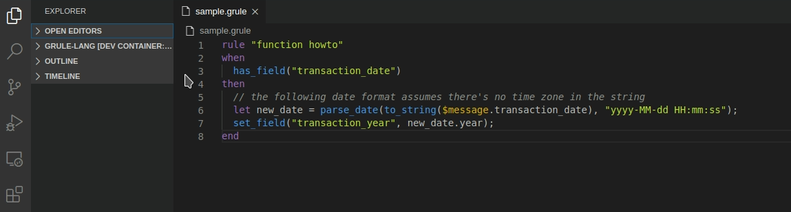

## Features

This language extension for syntax highlight and parser for graylog pipeline rule.

## Release Notes

### 0.4.1

* Fix vscode ext detect lsp client/server

### 0.4.0

* Support auto-completion language

* Add documentation and example for functions

### 0.3.0

* Support type for syntax highlight

### 0.2.0

* Add image preview sample

### 0.1.0

* Initial release of language